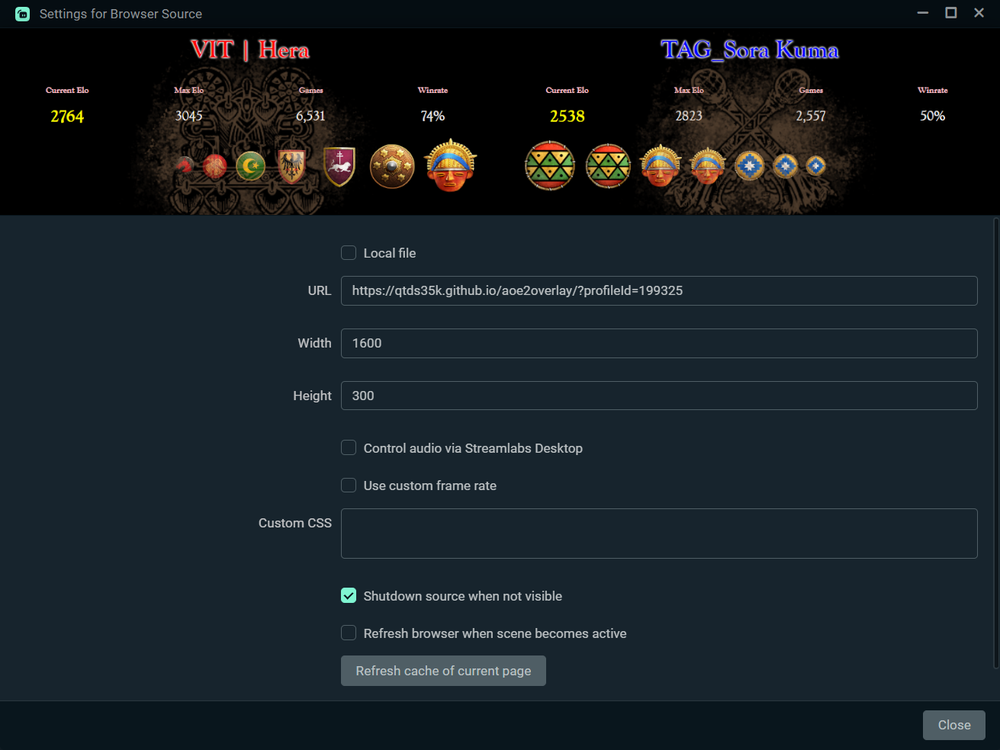

# AoE2 Overlay

## TL;DR for Streamers
1. Add a **Browser Source** in OBS / Streamlabs.
2. Set the URL to: `https://qtds35k.github.io/aoe2overlay/?profileId=YOUR_ID`
   *(Replace `YOUR_ID` with your numeric AoE2 profile ID, e.g., `199325` for Hera).*
3. Set **Width** to `800` and **Height** to `250` (adjust as needed for your layout).
4. Done! The overlay will automatically update your stats and opponent info while you play.

---

## Detailed Usage
1. Find your numeric AoE2:DE `profileId`.
    1. If you already use AoE2 Companion, open your player page and copy the numeric id from the URL.
    2. If you already have a working overlay/browser-source URL, you can reuse that same `profileId` value here.
2. In your streaming tool, add a Browser Source:
    1. Set URL as `https://qtds35k.github.io/aoe2overlay/?profileId=${YOUR_PROFILE_ID}`, e.g. `https://qtds35k.github.io/aoe2overlay/?profileId=199325`.
    2. Specify width and height according to your scene layout, typically a landscape orientation, e.g.
    

## Enjoy!
Feel free to file any bug report or feature requests!
- Create a thread here: https://github.com/qtds35k/aoe2overlay/issues/new
- Reach me via discord: `Monkie#5464`

## Sync civ assets from the local game install

This repo can now pull civ icons, emblems, and civ metadata directly from a local AoE2DE install.

- One-shot sync:
```powershell
python .\scripts\sync_game_assets.py
```
- Continuous watch mode:
```powershell
python .\scripts\sync_game_assets.py --watch
```

By default the script watches `C:\Program Files (x86)\Steam\steamapps\common\AoE2DE` and updates:

- `img/icons/`
- `img/emblems/`
- `resource/strings.json`

If Steam adds new civs in a DLC update and the game ships new assets/strings for them, rerunning the script or leaving `--watch` running will bring them into this repo automatically.
