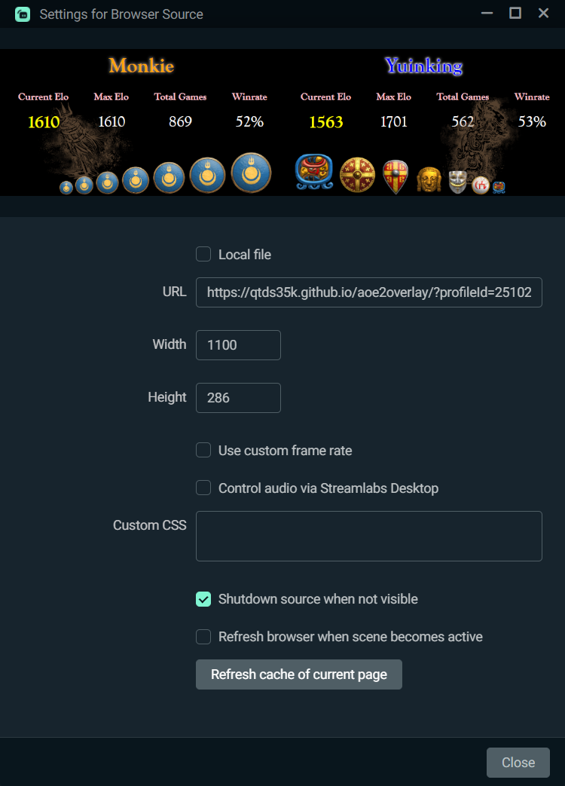

# Bruh I don't know jack shit about front-end development -- 99% of this respo is hacked out using ChatGPT.

## Usage
1. Find your aoe2.net profileId:
    1. Go to https://aoe2.net/#aoe2de-matches-my-recent-matches with you steam account signed in.
    1. Click on your name in any match -> Profile -> get your profileId in the url. E.g. copy `2510223` in `https://aoe2.net/#aoe2de-profile-2510223` .
1. In your streaming tool, add a Browser Source:
    - Set URL as `https://qtds35k.github.io/aoe2overlay/?profileId=${YOUR_PROFILE_ID}`, e.g. `https://qtds35k.github.io/aoe2overlay/?profileId=2510223` .
    - Specify width and height according to your scene layout, typically a landscape orientation, e.g.
    

## Enjoy!
Feel free to file any bug report or feature requests!
- Create a thread here: https://github.com/qtds35k/aoe2overlay/issues/new
- Reach me via discord: `Monkie#5464`